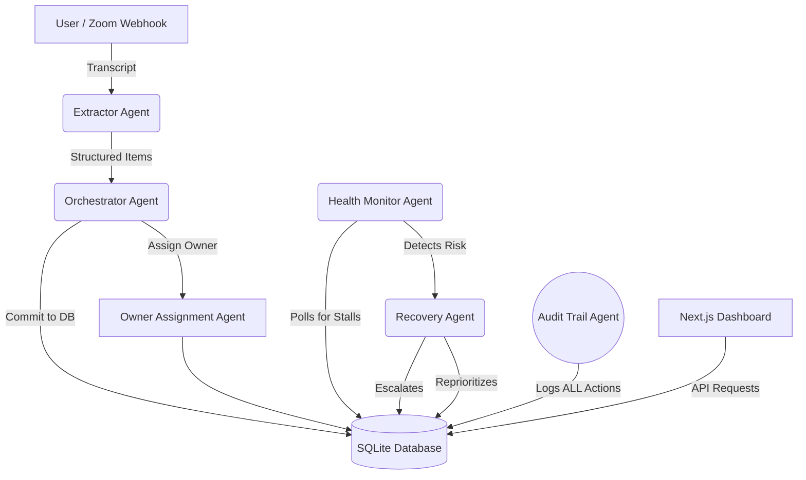

# Meeting-to-Execution Autopilot Architecture

## Agentic AI for Autonomous Enterprise Workflows

The AutopilotOS uses a micro-agent architecture to handle distinct phases of workflow orchestration. Rather than relying on a single monolithic LLM call, specialized agents coordinate via an event-driven system built on FastAPI and tracked by an immutable SQLite ledger.

### Architecture Diagram

### Agent Roles

**1. Extractor Agent**  
Receives raw text (or audio payloads in production) and surfaces Decisions, Action Items, Dependencies, and Priorities. Produces Confidence Scores. If confidence is < 0.8, it flags the item for Human Approval.

**2. Orchestrator Agent**  
Acts as the Director. Takes raw payload from the Extractor and maps it to specific Database entities (Tasks, Deadlines). Evaluates inter-task dependencies.

**3. Owner Assignment Agent**  
If an action item lacks a clear owner (e.g., "someone needs to fix the DB"), this agent uses historical context and role inference to propose an owner. 

**4. Health Monitor Agent**  
Runs asynchronously to detect stalled tasks, missed SLAs, or dependency deadlocks.

**5. Recovery Agent**  
Triggered by the Health Monitor. Self-corrects the workflow by reassigning the task, bumping priority, or escalating to management if the risk factor is high.

**6. Audit Trail Agent**  
Observes every read/write action from other agents. Logs the Action, the Reason, the precise timestamp, and the confidence interval. Forms the backbone of Trust in the system.

### Integration Points

While this repo uses local SQLite, the adapters are structured such that:
- `Extractor Agent` -> Calls OpenAI/Gemini API for inference.
- `Recovery Agent` -> Sends Slack webhook or Jira API call.
- `Health Monitor` -> Pulls PR status from GitHub API.

### Technical Stack
- **Frontend Core**: Next.js 14 (App Router)
- **Styling**: Tailwind CSS V4 + Pre-built UI layout
- **Backend Core**: FastAPI (Python 3.12)
- **Database**: SQLAlchemy + SQLite
